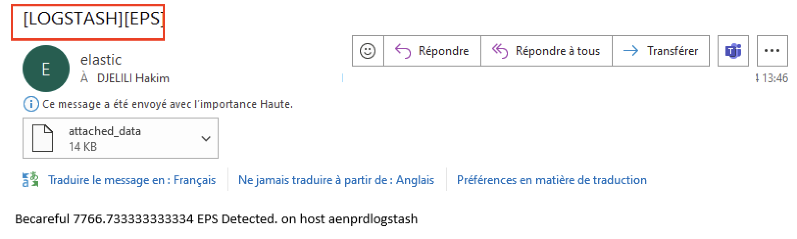

# 
ALERTING TIPS

  
This module brings together examples of alerting that I have implemented in large companies 🏢.

The alerts can involve monitoring the Elastic infrastructure ⚙️, searching for patterns in application logs 🔍, or tracking thresholds in middleware logs 📈.

## 🧐 1 MONITORING LOGSTASH EPS

### Description

- This watcher will monitor the number of events per second (EPS) that Logstash ingests and processes ⚙️📊.

- The infrastructure must be resilient, especially when setting up a SOC 🛡️, so every bottleneck must be closely monitored 🚦.

- Depending on Logstash's resources, it is important to monitor the EPS to anticipate a Heap Overflow 🧠💻.

### Data Collection

- You need Metricbeat data from Logstash to proceed.
Install Metricbeat and configure the Logstash-Xpack module, which will retrieve the metric data on Logstash’s default port 9600 ⚙️📈.

### Image

## 🙇 Author
#### hack'im
- Linkedin: [@hak'im](https://www.linkedin.com/in/hakim-djelili/)
